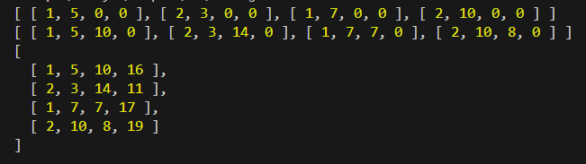

# 분석

## 풀이

- 3행 N열의 가중치 배열이 주어지는데, 여기서 조건에 맞도록 원소들을 선택해서 가중치 합의 최대를 리턴해야함
  - 단 각 열에 적어도 하나는 놓여야함
  - 어떤 선택된 원소의 상하좌우의 원소는 선택불가능

* 일단 전체 합이 최대가 되려면, 각 행에서의 합부터가 최대가 되어야함

  - 다만 행에서의 합이 최대더라도, 어떤 행의 선택 경우의 수가 다른 행의 최대 선택을 간섭하여 최대 가중치가 못나올수 있으므로 이걸 고려해야됨

* 일단 각 열을 돌면서, 합이 최대가 되는 열을 찾고, 그 열을 기준으로 제약 조건을 만족시키면서 나아가야하나?

  - 그런데 어떤 열이 최대가 된다고 선택했는데, 그 옆에 있는 열들의 어떤 선택 조합이 더 크다면 어떡하지?

* 방법이 생각이 안난다... 책을 보자

## 정답

- 위와같이 dp라는 배열에 어떤 열의 각 행의 원소를 선택했을 때 조건에 따라 가능한 이전 열의 패턴 중 최대가 되는 패턴을 더하여 저장한다
  - 그러면 결국 순회의 마지막에 가서는 마지막 열에 다양한 패턴을 거친 최대값 후보군들이 존재하게 되고, 이 중 최대값을 고르면 그것이 배치패턴의 최대 가중치가 된다
