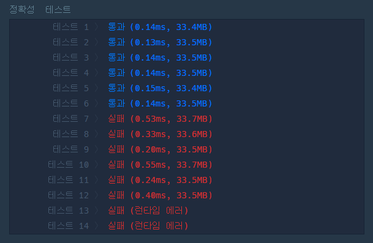
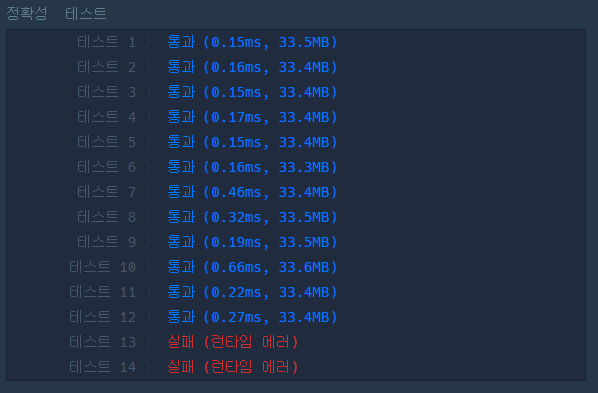

# 분석

## 풀이

- 입력 n이 있을때, n 번째 피보나치 수를 1234567로 나눈 나머지를 반환해야함

* 재귀를 이용해 피보나치를 구현하되, 메모이제이션을 이용해 스택 오버플로우가 발생하지 않도록함

* 근데 정확성 테스트에서 계속 일부가 실패한다
  

  - 이유를 모르겠어서 GPT와 책을 참조했다

* n이 커지면서 피보나치 수가 너무 커짐에 따라 자바스크립트의 정수 제한 범위를 초과해버려서 정확한 값이 계산이 안된다고 말하고있다

  - 이를 해결하기위해서는 모듈러 연산을 이용해 수를 분해하여야한다
  - 모듈러 연산은 두 수를 더하여 모듈러 연산을 한 것과 각각의 수를 모듈러 연산하여 더한 다음 다시 모듈러 연산을 한 것이 같다

  * 따라서 큰 수를 한 번에 모듈러 연산하기 보다는 최대한 작은 수를 모듈러 연산하는 것이 좋다

* 각 연산마다 모듈러 연산을 해주고 마지막에 한 번 더 모듈러 연산을 해주는 식으로 수정했더니, 처음보다는 훨씬 통과되는 테스트 케이스가 늘어났다. 하지만, 마지막 두 개의 테스트 케이스는 여전히 런타임 에러가 발생한다
  

* 결론적으로는 문제는 결국 재귀였다 -> 재귀 콜스택이 너무 많이 쌓여서 콜스택 초과 오류가 나는것이다
  - 걍 반복문을 써서 풀면 문제는 해결된다
