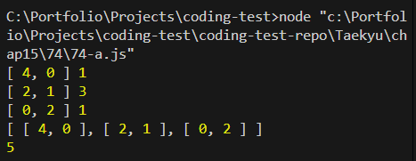

# 문제 분석

## 풀이

- 타일을 채우는 방식은 두가지 종류가 있는듯하다
  - 하나는 세로로 세워서 가로의 한 칸을 채우는 방식
  - 다른 하나는 가로로 눕힌걸 세로로 2개 나열해서 가로 2칸을 채우는 방식

* 즉 가로길이 n을 만족시키기 위한 1 또는 2의 합의 조합을 구하면되는듯

  - a X 1 + b X 2 = n
  - 2b = n - a -> b = 1/2(n - a)
  - a = n - 2b

* 실행 결과
  

* 근데 테스트 케이스에서 거의 전부 다 틀린다
  - GPT에 원인을 물어봤더니 다음과 같이 답한다
    1. 팩토리얼 Overflow & 부동소수 정밀도
       - factorial(171)부터 JS Number는 Infinity가 됩니다. n=60,000이면 말할 것도 없이 전부 Infinity/정밀도 손실 → NaN/엉뚱한 값.
    2. 모듈러에서의 나눗셈 오해
       - C(a+b, a) = (a+b)!/(a! b!)를 그대로 계산한 뒤 % 1e9+7을 하면 틀립니다. 모듈러에서의 나눗셈은 “모듈러 역원”으로 곱해야 해요. 즉, (x / y) % M이 아니라 (x \* inv(y)) % M. 이걸 하려면 미리 팩토리얼/역팩토리얼을 모두 전처리해야 하고, JS Number 한계도 넘어섭니다.
    3. 불필요하게 어려운 접근
       - 이 문제는 전형적인 2×n 타일링 → 피보나치 점화식입니다.
         세로 배치 → 너비가 1 줄어듦, 가로 2장 배치 → 너비가 2 줄어듦
         따라서 dp[n] = dp[n-1] + dp[n-2], dp[1]=1, dp[2]=2.

## 교재 정답

- 책을 봤더니 너무 쉽게 풀어서 놀랐다.
- 동적계획법을 이용해 n번째의 경우의수는 n-1번째 경우의수와 n-2번째 경우의 수의 합이라는 점화식을 놓고 문제를 해결했다
