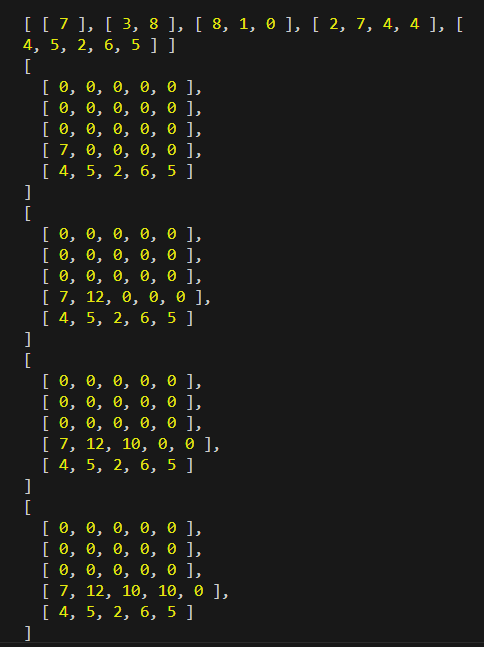

# 문제 분석

## 풀이

- 삼각형 모양의 경로의 성분들을 갖는 이차원 배열이 주어지고, 꼭대기에서부터 바닥까지갈때 거쳐가는 경로 숫자의 합이 가장 큰 경우를 반환해야함

* 작은 삼각형이 반복되어서 큰 삼각형을 만드는 구조임 -> 동적계획법을 쓰기 적합

* 일단 해당 구조에서 자신의 왼쪽 자식 방향과 오른쪽 자식 방향을 어떻게 구하는지를 해결해야함
  [[7], [3, 8], [8, 1, 0]]
  [0][0] [1][0],[1][1] [2][0],[2][1],[2][2]
  [7,/ 3, 8,/ 8, 1, 0]
  왼쪽 자식은 [i+1][j]
  오른쪽 자식은 [i+1][j+1]

* 일단 75-a는 틀린것같다

  - 왜냐하면 해당 로직은 계속해서 큰 쪽 자식을 선택하는 로직인데, 이게 100% 가장 거쳐간 숫자합이 최대가 되는건 아닌게, 작은쪽 자식을 선택한 경로에서 엄청나게 큰 숫자가 나올수도 있기 때문이다

* 위와같은 방식이 아니라 각 경로까지의 경우의수를 다 어떤 자료구조에다 저장하면서 최종적으로 도착한 후 누적된 값들을 비교해서 최대값을 선정하는 식으로 해야될것같다 -> 즉 모든 경우의 수를 고려한다

* 못풀겠음... 아이디어 생각이 안남 GG

## 교재

- 삼각형에서 진행방향을 아래에서 위로 바꿈 -> 이러면 갈수록 고려해야할 수가 점점 줄어들어서 더 깔끔한 처리를 할 수 있음

