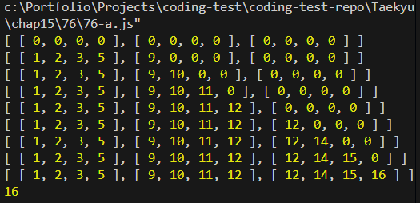

# 문제 분석

## 풀이

- 76-a

  - 교재에 있는 테스트케이스에 대해서는 의도한대로 제대로 정답이 나온다
  - 하지만 프로그래머스를 돌려보니 정확도도 효율성도 통과하지 못한다
    

  * 문제점
    dp[i][j] = dp[i - 1][j] + Math.max(...land[i].filter((\_, idx) => idx !== j));
    이전 행의 같은 열(dp[i-1][j])에 현재 행의 다른 열의 ‘원시 점수(land[i][k])’를 더하고 있어요.
    이러면 “누적 최대값”을 제대로 이어받지 못하니 정확성도, 효율성도 망가집니다.

    - 보면은 내가 세운 점화식은 다음과같은 논리적 모순이 있음
      dp[i-1][j]: (i-1)행에서 j열로 끝난 최댓값

      max(land[i][k] | k ≠ j): i행에서 j가 아닌 어떤 k열 하나의 ‘원시 점수’

      즉, 이 식이 만드는 경로는 (i-1행 j열) → (i행 k열) 이고, i행에서의 최종 열은 k 입니다.
      그런데 그 값을 여전히 인덱스 j에 저장하고 있어요. 즉, dp[i][j]가 “i행에서 j열로 끝난 값”이 아니라 “i행에서 k열로 끝난 값(단 k≠j)”을 담게 됩니다.
      이렇게 되면 다음 단계에서 dp[i][*]를 참조할 때 “i행에서 어느 열로 끝났는지” 정보가 뒤틀려서, 진짜 최적 경로가 누락될 수 있어요.

- 정석 점화식은 다음과같음
  dp[i][j] = land[i][j] + max(dp[i-1][k]) (단, k ≠ j)

* 76-b
  - 점화식을 수정했더니 테스트를 통과하였다
